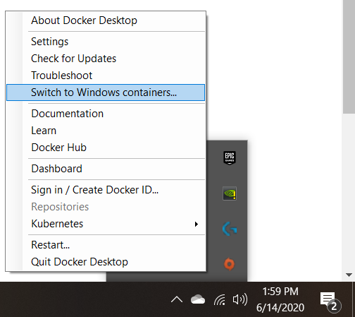
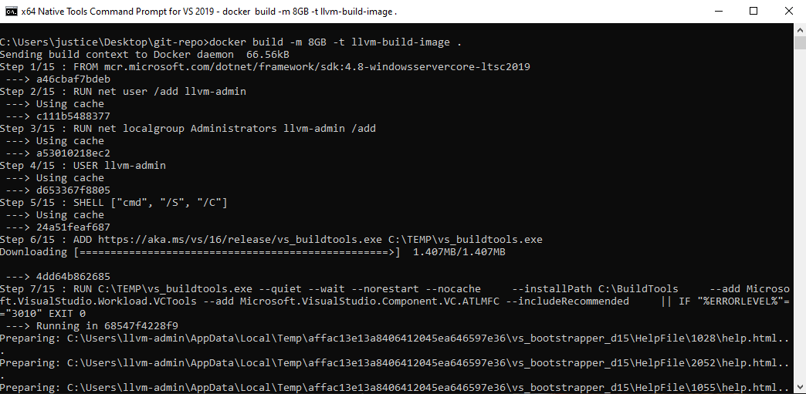
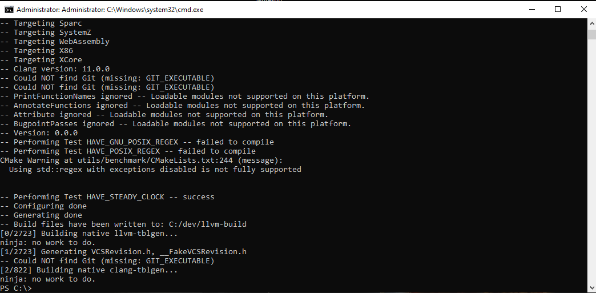
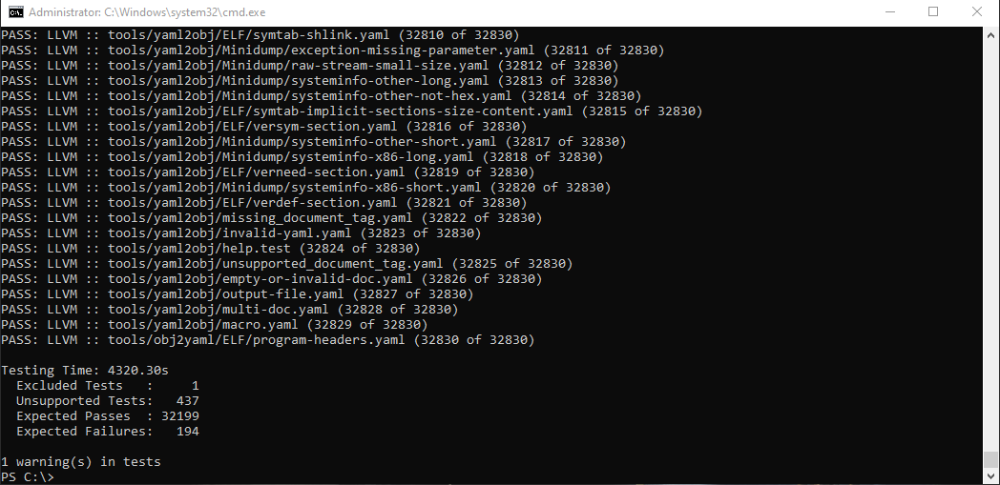

# LLVM Windows Dockerfile

This is the repo for the Windows-based LLVM build/test dockerfile which can be used
to build/test LLVM executables within a Windows Docker container. This docker image can then be used in container orchestration
systems.

## The motivation
There currently is not an official LLVM docker image that runs with Windows containers. All of the currently available options are Linux-container based. This is less than ideal for anyone developing LLVM based products which will be used in Windows environments who want to utilize the power of Docker containers for their build/test/deploy infrastructure. If you look a the [upstream LLVM] directory(https://github.com/llvm/llvm-project/tree/master/llvm/utils/docker), you'll find dockerfiles for Ubuntu and Red Hat based docker images. Thus, I set out to build a simple Dockerfile that can be used to build/test an LLVM build with your windows-based container systems.

## How to build the docker image
If you wish to build the docker image, you first must switch your Docker system to use Windows containers. You can do so by right-clicking the Windows tray icon for Docker and clicking "Switch to Windows Containers...".



Once your system is configured to run Windows containers, simply build the docker image by running an administrator command prompt and cloning this repository. Once within this repositories directory, run the following command to build a docker image named `llvm-build-image `
```
docker build -m 8GB -t llvm-build-image .
```
This will build the docker image which you can use to mount/copy your LLVM source into in order to build/test your upstream LLVM-based source.



## Running the container and building your source
To run the docker container, run the following command to start the container with your mounted in LLVM source checkout. Be sure to mount your output folder as well if you want to save the results on your local hard drive (If you need the build/test files output).
```
 docker run -it --rm -m 8GB --cpus 6 -v <LOCAL_LLVM_CHECKOUT>:C:\llvm -v <LOCAL_LLVM_BUILD_FOLDER>:C:\llvm-build -v <GIT_REPO_CHEKCOUT>:C:\scripts llvm-build-image
```

be sure to replace the following variables from the command above accordingly:
* `<LOCAL_LLVM_CHECKOUT>`: The path to your local LLVM source checkout. This will get mounted into the running container and used to build
* `<LOCAL_LLVM_BUILD_FOLDER>`: The path to an empty folder on your machine. This will get mounted into the running container and used to Output the LLVM build directory. You can omit this argument if you don't want the output files saved on your machine, however, this might require altering the docker run command to allocate more storage to the container.
* `<GIT_REPO_CHEKCOUT>`: The path to this repository on your local machine. This will mount in the Scripts needed for building/testing LLVM to make things simpler for you.

To build your LLVM source, you can use the simple batch file once running the container by running the following command
```
cmd /c C:\Scripts\build_llvm.bat C:\llvm C:\llvm-build
```
This will look in the C:\llvm directory for your source and output the build to C:\llvm-build which you previously mounted in. The build process uses [Cmake](https://cmake.org/), [Ninja](https://ninja-build.org/), and the [VS toolchain](https://visualstudio.microsoft.com/downloads/#build-tools-for-visual-studio-2017) to build all of LLVM + clang. You can change the arguments to the script accordingly to build from a different location/output to a different location.



## Testing your built source from within the container
I've also included a simple batch file to run all python lit tests from within the container. Simply run 
To build your LLVM source, you can use the simple batch file once running the container by running the following command
```
cmd /c C:\Scripts\test_llvm.bat C:\llvm C:\llvm-build
```
with the same arguments as the build command. This will use python to run all the LLVM lit tests within the docker container to test your source code.



This will look in the C:\llvm directory for your test source and use the binaries in the C:\llvm-build folder to perform the tests. u can change the arguments to the script accordingly to test executables in a different location.

## What can you do now
What's nice about having an LLVM docker image is you can now plug this into your container orchestration system and quickly spin up containers to build/test LLVM in your CI system within a Windows environment. This will ensure a consistent environment for building and testing with each run of your CI system. You could also do some nifty tricks such as spinning up multiple containers simultaneously to build/test different configurations at the same time. The power is yours. Creating/Improving build/test/deploy infrastructures is essential to delivering quality software.


## Things to note
* The following [test](https://github.com/llvm/llvm-project/blob/master/llvm/test/tools/llvm-objcopy/ELF/build-id-link-dir.test) is not run when LLVM lit tests are executed. This specific test creates a symlink which causes issues within Docker containers. This is a known limitation of Docker containers, unfortunately. If you are changing something relevant to this source (llvm-objcopy) and you want to be sure these tests pass, you will need to run it outside of the container environment.
* When running the docker container, be sure to give your docker container enough memory. I recommend at least 8GB but 12GB will make things run a bit smoother. LLVM is big, and as such, requires a lot of heap space when building. This is highlighted in the run command above which specifies `-m 8GB`

## Future work
* Get this dockerfile upstreamed. This will probably require opening a conversation on the llvm-dev mailing list and furthermore updating the following [scripts](https://github.com/llvm/llvm-project/tree/master/llvm/utils/docker/scripts) to have batch file equivalents so that they can run within the Windows containers.
